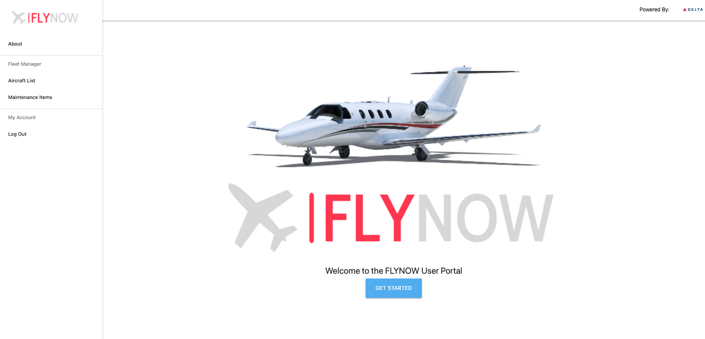
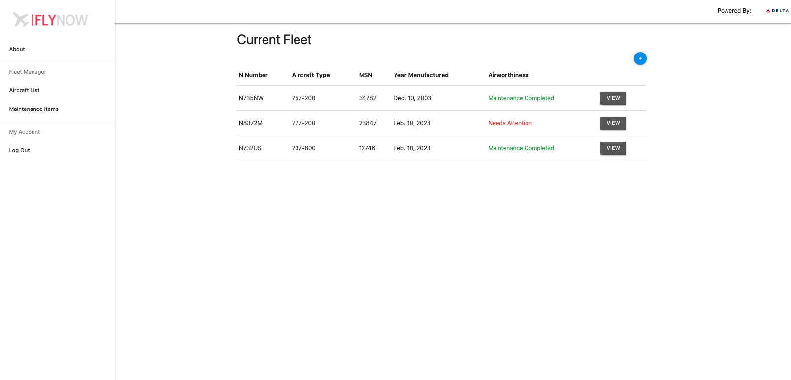

# Fleet Manager
FlyNow is a next-generation, multi-user, "schedule-to-mobile" fleet management product that delivers greater efficiency and productivity for flight departments of any size.

It utilizes a flight log and a maintenance log to keep track of your aircraft fleet.

### Technologies Used
* Django
* Python3
* PostgreSQL
* Materialize CSS
* Javascript
* HTML

### Screenshots

### Getting Started
From the landing page, login with an existing account or register for a new one.

Create new aircraft for your fleet on the "Aircraft List" page.

Update aircraft informatioon with new flights or maintenance items.

[Click Here](https://fleetmanager.herokuapp.com/) to go to the deployed app

### Future Enhancements
* Determine airworthiness based on all maintenance items being complete
* Calculate age of the aircraft based on year manufactured
* Determine maintenance requirement based on maintenance date completed